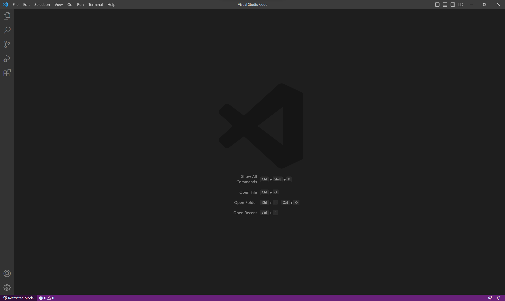

# Lab Report 1

*This is a simplified version of tutorial about remote accessing divided into three parts to facilitate hands-on experiences with stage-based outputs.*

## Installing Visual Studio Code (VScode)

In order to download to Visual Studio Code (which will be refered as VScode thereafter), we would need to first go to its website https://code.visualstudio.com/ to download the corresponding version of it based on the current operating system. After installment, you'd be able to see a window like this if you open VScode:

Then you are all set to move on to the next section.

## Remote Connection

In order to have remote access, prerequisite is that the VScode is equipped with git bash. Refer to this tutorial to set up the git bash for VScode: https://stackoverflow.com/questions/42606837/how-do-i-use-bash-on-windows-from-the-visual-studio-code-integrated-terminal/50527994#50527994

Then, you would use ssh comand to connect to the ieng6 account. The format of ssh command shall be 

*ssh cs15lsp23zz@ieng6.ucsd.edu*

With which "zz" shall be adjusted to correspond to your own course-specific account, which could be looked up by https://sdacs.ucsd.edu/~icc/index.php, and you are supposed to set up a password for this course-specific account as well, by which there's also a tutorial for: https://drive.google.com/file/d/17IDZn8Qq7Q0RkYMxdiIR0o6HJ3B5YqSW/view\

With your VScode window open, use the Terminal → New Terminal menu option to create a new terminal, in which you will type in the ssh command shown above.
