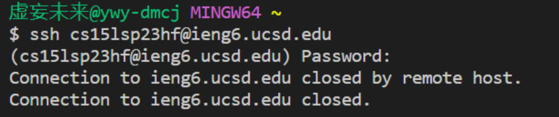
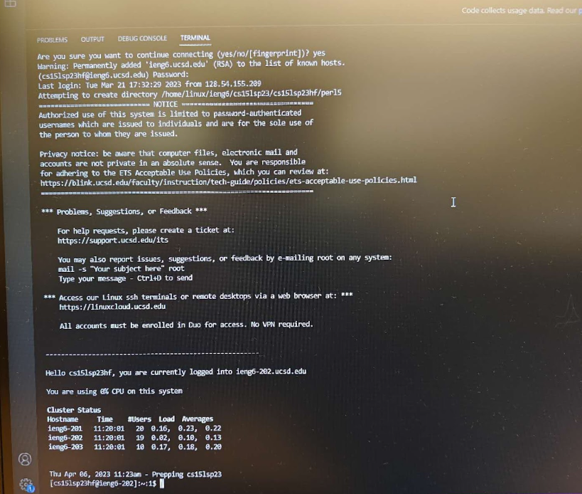
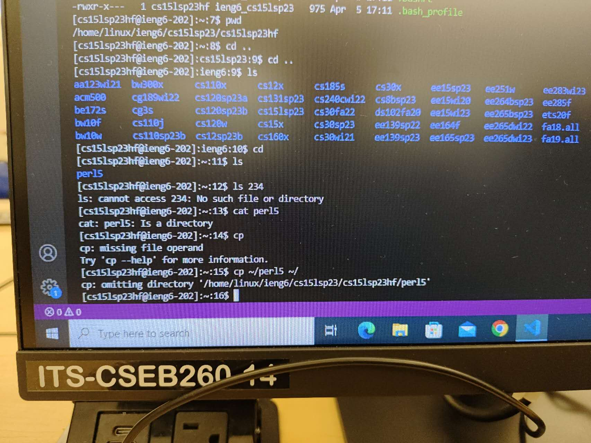

# Lab Report 2

## Part 1

Based on the instructions, here is the code for StringServer:

```
import java.io.IOException;
import java.net.URI;
import java.util.ArrayList;

class Handler implements URLHandler{
    ArrayList<String> store = new ArrayList<>();
    String output;
    public String handleRequest(URI url) {
        if (url.getPath().equals("/")) {
            return new String("This is a String server that allows you to add string segments to be displayed.");
        } 
        else if (url.getPath().contains("/add-message")) {
            output = "";
            String[] parameters = url.getQuery().split("=");
            if (parameters[0].equals("s")) {
                store.add(parameters[1]);
            }
            for(String i:store){
                if(i != null){
                    output += i + "\n";
                }  
            }
            return output;
        }
        else    
            return "404 Not Found!";
    }
}

class StringServer{
    public static void main(String[] args) throws IOException {
        if(args.length == 0){
            System.out.println("Missing port number! Try any number between 1024 to 49151");
            return;
        }
        int port = Integer.parseInt(args[0]);
        Server.start(port, new Handler());
    }
}
```
When running this code with the port 1024, two implementation of "add-message" commands are shown as follows:
  


For the first case:
  
* The method handleRequest is invoked with the specific subcase "else if"
* The value of "getPath()" is "/add-message" and the value of "getQuery()" is "s=CSE15L", and the arraylist store initially does not store any values, so does the string output.
* The values of arraylist store changes by having string "CSE15L" as its first position, and the value of output into "CSE15L\n"

For the second case:

* The method handleRequest is invoked with the specific subcase "else if"
* The value of "getPath()" is "/add-message" and the value of "getQuery()" is "s=CSE15LSP23", and the arraylist store initially stores string "CSE15L" as its first position, and output initially stores "CSE15L\n".
* The values of arraylist store changes by having string "CSE15LSP23" as its second position, and the value of output into "CSE15L\nCSE15LSP23\n"

## Remote Connection

In order to have remote access, prerequisite is that the VScode is equipped with git bash. Refer to this tutorial to [set up the git bash for VScode](https://stackoverflow.com/questions/42606837/how-do-i-use-bash-on-windows-from-the-visual-studio-code-integrated-terminal/50527994#50527994).

Then, you would use ssh comand to connect to the ieng6 account. The format of ssh command shall be 

*ssh cs15lsp23zz@ieng6.ucsd.edu*

With which "zz" shall be adjusted to correspond to your own course-specific account, which could be looked up by [This Link](https://sdacs.ucsd.edu/~icc/index.php), and you are supposed to set up a password for this course-specific account as well, by which there's also a [tutorial](https://drive.google.com/file/d/17IDZn8Qq7Q0RkYMxdiIR0o6HJ3B5YqSW/view\).

With your VScode window open, use the Terminal → New Terminal menu option to create a new terminal, in which you will type in the ssh command shown above.



If this output above comes up on your laptop, don't panic and ask your instructor or TA immediately, as they may allow you to work on the computers in those labs on campus. Normally, the output shall be as follows:



Given this is not a screenshot based on its inablity to be reproduced, here's a screenshot of the output of a normal login after your first successful login:


## Trying Commands Out!

Here are some commands for you to try out when you have successfully connected to the remote computer:

* cat <path1> <path2> ... - “Concatenate” Used to print the contents of one or more files given by the paths
* ls <path> - “List” Used to list the files and folders the given path
* pwd - “Print working directory” Used to display the current working directory
* cd <path> - “Change Directory” Used to switch the current working directory to the given path (without an argument, cd is equivalent to cd ~, which is the home directory)

In case any of you would be interested to see an error, an example would be to invoke a file that does not exist, which is also reflected through the set of commands below:
  

  
*That's all for the tutorial, now you are more than welcomed to navigate and explore this brave new world!*
